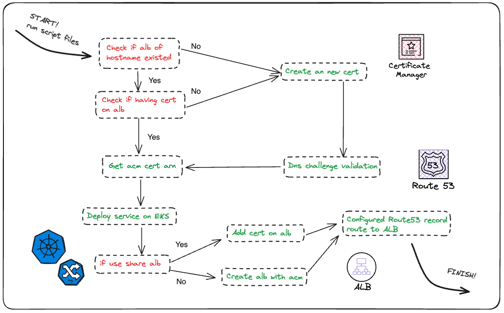

# EKS-ALB-ACM Helper

A tool to automatize the workflow whenever you need an EKS ingress which using ALB that needs ACM certificate as well as correct dns setting on Route53.

## Table of Content

- [What this tool can help you](#what-this-tool-can-help-you)
- [How it works](How-it-works)
- [How to use this tool](#how-to-use-this-tool)
  - [Prerequisite](#prerequisite)
  - [Steps to use](#steps-to-use)
  - [Clean up resources](#clean-up-resources)

## What this tool can help you

- Acquire AWS ACM certificate for your service, and validate it with route53 dns challenge.
- Create EKS ingress manifest for your service and associate with ALB as ingress.
- Associate ACM certificate onto ALB.
- Create Route53 record that routes service hostname to ALB of service ingress.

## How it works



1. Check ALB / ACM existed

   Use AWS CLI to check if ALB has certificate of service hostname

   - If yes, record the ACM ARN
   - If no, request a new ACM certificate. And then get ACM dns challenge content, and add the record to Route53 to complete the validation

2. Handle helm chart values

   Replace `certificateArn` in helm `value.yaml` as the ACM ARN gets from step 1. The generated manifest will look like：

   ```yaml
   apiVersion: networking.k8s.io/v1
   kind: Ingress
   metadata:
     annotations:
       alb.ingress.kubernetes.io/certificate-arn: <ACM ARN>
       alb.ingress.kubernetes.io/listen-ports: '[{"HTTP": 80}, {"HTTPS": 443}]'
       alb.ingress.kubernetes.io/scheme: internet-facing
   ```

3. Handle EKS ingress / ALB

   - EKS AWS Load Balancer Controller will use annotation `kubernetes.io/ingress.class: alb` and `alb.ingress.kubernetes.io/load-balancer-name: <albName>` to associate/create ALB, and then associate ACM certificate assigned/created from previous steps onto it.
   - If you want to share ALB to multiple services, assign alb group name to prompt question. It will add `alb.ingress.kubernetes.io/group.name: <albGroup>` annotation to ingress manifest, which will add multiple certificates in ALB SNI List.

4. Create route53 record by AWS CLI, point service hostname to ALB DNS name.

## How to use this tool

### Prerequisite

- Installed AWS CLI / Helm
- Configured aws `credentials` and `config` in `.aws` directory, and make sure your profile have permission of AWS ACM, Route53, ALB, EKS
- Have Route53 hosted zone with the domain you owned
- Have EKS resources and AWS Load Balancer Controller installed inside. (If you use build-infra feature of this tool, it is already included).
- (optional) Build-infra feature requires Terraform to be installed as well.

### Steps to use

1. Git clone project to your local machine.
2. Execute `./run.sh`.

   - You can choose to prepare `config` file first. Refer to `script/config.example` and create `config` file in the `script` folder.
   - Or you can just answer the following prompt questions and let the tool generate it.

   ```
   # mandatory
   1. host name of your service?
   2. domain name of your service?
   3. helm chart name? (will create if not exist)
   4. loadbalancer name? (will create if not exist)

   # optional
   5. insert the alb group name if you want to use shared ALB
   6. helm chart path? (default to ./helm)
   7. helm values path? (default to ./helm/values.yaml)
   8. insert 'true' if you want to build infra to play
   9. insert 'true' if you want to use private hosted zone
   ```

3. The tool will default to use files in `helm/` to create helm chart based on your input. If you want to integrate with your existing helm chart, you need to include the following snippet in your helm files, and assign the path to your helm resources when questions prompt:

   - In ingress.yaml:

     ```yaml
     {{- with .Values.ingress.type}}
     annotations:
     {{- if eq $.Values.ingress.type "alb" }}
        kubernetes.io/ingress.class: alb
        alb.ingress.kubernetes.io/load-balancer-name: {{ $.Values.ingress.albName }}
        alb.ingress.kubernetes.io/listen-ports: '[{"HTTP": 80}, {"HTTPS": 443}]'
        alb.ingress.kubernetes.io/ssl-redirect: '443'
        alb.ingress.kubernetes.io/target-type: ip
        alb.ingress.kubernetes.io/scheme: internet-facing
        alb.ingress.kubernetes.io/certificate-arn: {{ index $.Values.ingress "certificateArn" }}
     {{- with $.Values.ingress.albGroup }}
        alb.ingress.kubernetes.io/group.name: {{ . }}
     {{- end }}
     {{- else }}
        {{- toYaml . | nindent 4}}
     {{- end }}
     {{- end }}

     ```

   - In values.yaml:

     ```yaml
     ingress:
       enabled: true
       type: alb
       certificateArn: ''
       albName: ''
       albGroup: ''
     ```

4. (optional) If you want to try this tool for playing but do not have existing EKS resources, just set `true` to the question:
   ```
   8. insert 'true' if you want to build infra to play
   ```
   The tool will create AWS EKS/VPC and set up the required settings for you. Review the plan provided by Terraform and confirm it to proceed. It will take some time for the first time.

### Clean up resources

Execute `./cleanup.sh` to clean up. It will delete the following resources created by this tool:

- Helm release
- ALB
- ACM certificate
- Route53 record
- Terraform resources (if you used build-infra feature)

Check the files under `cleanup/` before you proceed if you're not sure what was created. You can delete the files/variables recorded so that the resources will not be deleted.

If you see some error message about resources not found, that might be caused by manual removal before.
